<br />

# `git` gives you superpowers

## (+ licensing your software)

[@samcunliffe] and [@mscroggs]

CDT CCMI Software Engineering Fundamentals, 90 High Holborn. 2025-12-01. 

[@mscroggs]: https://github.com/mscroggs
[@samcunliffe]: https://github.com/samcunlffe

---


# [scnlf.me/2025-12-01-supergit](https://scnlf.me/2025-12-01-supergit)

---

<!--
paginate: true
footer: `git` superpowers (and licensing). 2025-12-01.
-->

# Our plan for this morning

0. Commit cleanliness.
1. Log, checkout.
2. Branching, merging, rebasing.
   - Using a UI to look at branches.
3. Revert, soft reset, hard reset, force push.
4. Collaboration, pull requests, bug reports, ettiquette.
   - Co authoring commits, credit.
5. Choosing a license.

---

# Labouring the superhero and scifi analogy

0. ...
1. Time travelling.
2. Alternate universes.
3. With great power comes great responsibility.
4. Superhero teamups!
5. ...

---

# 0. Staging area, and commit cleanliness

---

<!--
_footer: Image: [Pro Git](https://git-scm.com/book/en/v2) / Ben Straub and Scott Chacon. CC BY-NC-SA 3.0. | Quote: GitHub Guides. CC-BY 4.0.
-->

<!-- prettier-ignore-start -->

* > _Commits should be logical, atomic units of change that represent a specific idea._
* > _But, not all humans work that way._

<!-- prettier-ignore-end -->


---

<!-- prettier-ignore-start -->

* Use `--amend` to fix things...

  ```
  git add a_file another_file  # two files on the stage
  git commit -m "Fix somthing."
  git add forgot_this_file
  git commit --amend  # add forgotten files or fix typos
  ```

* Use the `--staged` diff to check...

  ```
  git diff --staged
  git diff HEAD~1  # What does this do?
  ```

* Bypass the staging area with `-a,--all`.
  Commits all changes to all tracked files:
  
  ```
  git commit --all -m "I'm very confident"
  ```

<!-- prettier-ignore-end -->

---

# Good commit messages

```
Short descriptive and less than 50 characters
```

<br />

```
Short descriptive and less than 50 characters

A longer message that explains WHY the change was made in detail. Also
wrapped at 72 characters. Many editors will do this for you but if not,
it's worth remembering to do it manually.

Another paragraph is fine if you need it.

Co-authored-by: Matthew Scroggs <mscroggs@no-reply.github.com>
```

---

# Quick warmup exercise

Which of these commits are good?

<center>

|                   |                   |
| ----------------- | ----------------- |
| [Commit number 1] | [Commit number 2] |
| [Commit number 3] | [Commit number 4] |

</center>

[Commit number 1]: https://github.com/samcunliffe/basf2-history-fork/commit/16d74d6c5131aa6b59353f3dc93104c9d7bf5195
[Commit number 2]: https://github.com/belle2/basf2/commit/bad3579e020ed2b516f8625997a46a23de5fe9b5
[Commit number 3]: https://github.com/matplotlib/napari-matplotlib/commit/669cdc26bb6091f1209242b367820a2a6280233a
[Commit number 4]: https://github.com/samcunliffe/basf2-history-fork/commit/d8477ae8df7032207178c80a4ea96a017af59175

---

# 1. Time travelling

## (Understanding `git log` and `git checkout`)

---

<!--
_footer: Image: [Faces Of Open Source](https://www.facesofopensource.com) / Peter Adams. CC BY-NC-SA 4.0.
-->


<!-- prettier-ignore-start -->

* This is Linus.
* He started the Linux kernel project.
* He started the `git` project.
* ...because he needed something for collaborating on the kernel.
* The software project `git` was kept in `git` from quite early on.
* _Remember the human_ on the internet.

<!-- prettier-ignore-end -->

---

# Demo: let's look at `git`'s history in `git`.

---

<!-- prettier-ignore-start -->

* [The Git source code repository](https://github.com/git/git)

* Look at the recent history:

  ```
  git log 
  git log --oneline
  ```

* Look at the first commit:

  ```
  git log --reverse
  ```

* Actually travel back in time to an old commit:

  ```
  git checkout <commit-hash>
  git checkout <branch-name>  # go back to the future
  ```

<!-- prettier-ignore-end -->

---

<center>


</center>

---

# 2. Parallel universes

## (`git branch`, `git merge`, `git rebase`, and _looking_ at branches)

---

<!--
_footer: Image: Neil Shephard. CC BY 4.0.
-->



---

- List all branches:

  ```
  git branch
  ```

- Create a branch without switching to it:

  ```
  git branch <branch-name>
  ```

- Create a new branch and switch to it:

  ```
  git checkout -b <branch-name>
  git switch --create <branch-name>  # git 2.23+
  ```

- Switch between branches that already exist:

  ```
  git checkout <branch-name>  # or switch since git 2.23
  ```

---

# Demo: visualising branches

<!-- prettier-ignore-start -->

* Make a nice terminal graph:

  ```
  git log --graph --all --decorate --oneline
  ```

<!-- prettier-ignore-end -->

---

# Exercise: creating a branch and a merge conflict

## [Exercise instructions](https://github.com/samcunliffe/2025-12-01-supergit/blob/main/exercises.md#exercise-1-branches-and-merge-conflicts)

---

# Execise (time permitting): rebasing

## [Exercise instructions](https://github.com/samcunliffe/2025-12-01-supergit/blob/main/exercises.md#exercise-2-rebasing)

---

# 3. With great power comes great responsibility

## (`git reset`, `git push --force` when and when not to)

---

# Force pushes

- Don't fear the force push.
- But also, don't do it if you don't need to.
- A rule of thumb: if you're doing it more than once per month you've got a very strange workflow.


---

A **MUCH BETTER** option

# `--force-with-lease`

You almost always should be using that.

---

# 4. Superhero teamups!

---

# Jargon

- Repo: A Git repository. "GitHub repo" == Git repository on GitHub.
- Org: GitHub organisation.
- Fork: A copy of a repository in your own GitHub account or organisation.
  Also a verb:

  > _we've forked that repo into our org_

- PR: Pull request.
- MR: Merge request (GitLab).
- CI: Continuous integration (automated tests that run on each PR).

  > _The CI is broken!_ _Please fix the CI for this_

---

# Activity: add yourself to the CCMI CDT website

- Your CDT has a [website](https://ccmi-cdt.org/).
- The source code that builds the website is in a [Git source code repository](https://github.com/CCMI-CDT/ccmi-cdt.org).

---

# Sam and Matt's tips for collaborating on GitHub

- Read the CONTRIBUTING guidelines
  - Or chat with collaborators and agree on some (can change them later).
- Open draft pull requests early.
  - If in doubt, get feedback and ask for help.
- When you're pull request is ready:
  - Make sure the descriptions are clear and you've linked any issues.
  - Make sure tests and linters pass.
  - **Review it yourself**.
  - (Maybe contentious) Ask `@Copilot` to review it.
  - Then mark it as ready for review and request reviews from humans.

---

# Working together

- Two people together at one keyboard _or_ coding together over a video call.
- Screen sharing, pair programming tools ([VS code live share](https://visualstudio.microsoft.com/services/live-share/)).
- Share credit with co-authored commits:

```

git commit -m "A commit message

Co-authored-by: Matthew Scroggs <mscroggs@no-reply.github.com>"

```

---

# 5. Choosing a license

---

# Open source

<!-- prettier-ignore-start -->

- [Open source initiative defines 10 things that make a project open source](https://opensource.org/osd).
- If you're writing research code for funded research you may _have_ to open it.
- If you're working on a project with an industrial partner: check first.
- (At UCL) Students retain copyright of their work.
* We tend to work "open by default".
- More secure?
- Easier to debug.
- Easier to collaborate.
- Easier to cite and get credit.

<!-- prettier-ignore-end -->

---

# Sam and Matt's tips for choosing a license

## [Browse choosealicense.com](https://choosealicense.com/)

- Think about this at the start of a project.
- Use an OSI approved license (don't write your own).
- Go as permissive as you can.
- Be aware of GPL code and linking against GPL libraries.
- Follow your community’s normal license if you don’t have some reason to do something else.

---

# The main ones

<center>

|              |                |
| ------------ | -------------- |
| [MIT]        | [BSD 3-Clause] |
| [Apache 2.0] | [GPLv3]        |

</center>

[MIT]: https://choosealicense.com/licenses/mit/
[BSD 3-Clause]: https://choosealicense.com/licenses/bsd-3-clause
[Apache 2.0]: https://choosealicense.com/licenses/apache-2.0/
[GPLv3]: https://choosealicense.com/licenses/gpl-3.0/

---

# Public code but no license?

## [Here's what choosealicense.com says](https://choosealicense.com/no-permission/)

---

# Conclusions

- `git` is a really useful tool and you'll probably use it all the time.
- GitHub is a place where a lot of code is, and yours will go there too.
- Working together is much more fun.
- Think about licenses.

---

```

```
