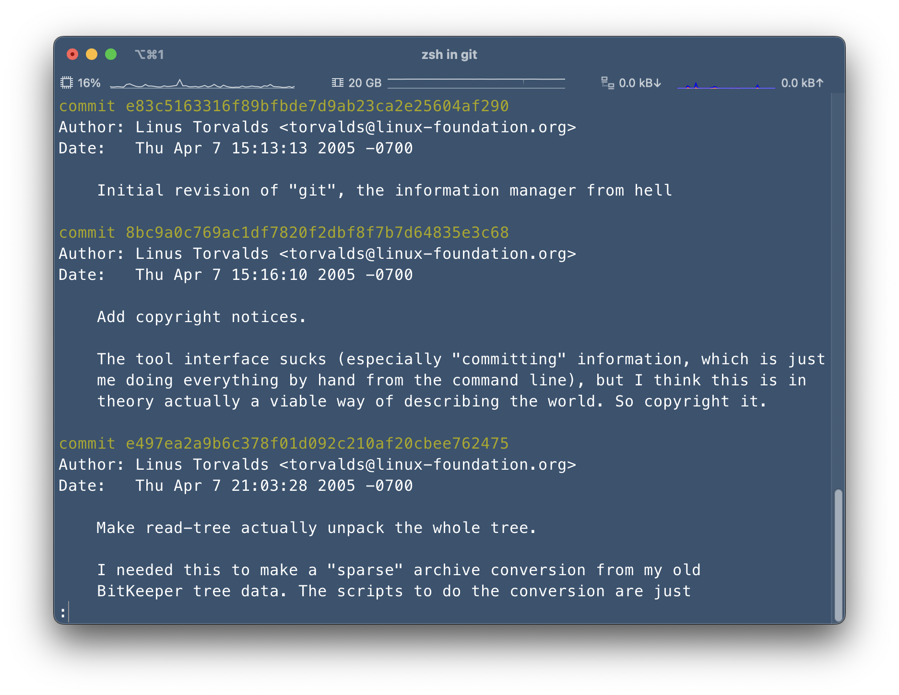
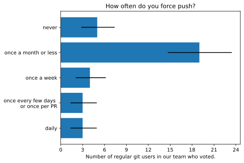

 

# `git` gives you superpowers

## (+ licensing your software)

[@samcunliffe] and [@mscroggs]

CDT CCMI Software Engineering Fundamentals, 90 High Holborn. 2025-12-01. 

[@mscroggs]: https://github.com/mscroggs
[@samcunliffe]: https://github.com/samcunlffe

---

<!--
paginate: true
footer: `git` superpowers (and licensing). 2025-12-01.
-->

# Our plan for this morning

0. Commit cleanliness.
1. Log, checkout.
2. Branching, rebasing.
   - Using a UI to look at branches.
3. Revert, soft reset, hard reset, force push.
4. Collaboration, pull requests, bug reports, ettiquette.
   - Co authoring commits, credit.
5. Choosing a license.
   - And other setup related to a new project.

---

# Labouring the superhero and scifi analogy

0. ...
1. Time travelling.
2. Alternate universes.
3. With great power comes great responsibility.
4. Superhero teamups!
5. ...

---

<!--
_footer: Image: [Pro Git](https://git-scm.com/book/en/v2) / Ben Straub and Scott Chacon. CC BY-NC-SA 3.0.
-->

# Staging area, commit

---

# 1. Time travelling

## (Understanding `git log` and `git checkout`)

---

<!--
_footer: Image: [Faces Of Open Source](https://www.facesofopensource.com) / Peter Adams. CC BY-NC-SA 4.0.
-->

<!-- prettier-ignore-start -->

* This is Linus.
* He started the Linux kernel project.
* He started the `git` project.
* ...because he needed something for collaborating on the kernel.
* The software project `git` was kept in `git` from quite early on.
* _Remember the human_ on the internet.

<!-- prettier-ignore-end -->

---

# Demo: let's look at `git`'s history in `git`.

---

---

# 2. Parallel universes

## (`git branch`, `git worktree`, and _looking_ at branchs)

---

---

# 3. With great power comes great responsibility

## (`git reset`, `git push --force` when and when not to)

---

# Force pushes

- Don't fear the force push.
- But also, don't do it if you don't need to.
- A rule of thumb: if you're doing it more than once per month you've got a very strange workflow.

---

A **MUCH BETTER** option

# `--force-with-lease`

You almost always should be using that.

---

---

---

---

# Conclusions

- `git` is a really useful tool and you'll probably use it all the time.
- GitHub is a place where a lot of code is, and yours will go there too.
- Working together is much more fun.
- Think about licenses at the beginning.

---

# Appendix

---

# Further reading

|                                                      |             |
| ---------------------------------------------------- | ----------- |
| [Pro Git](https://git-scm.com/book/en/v2)            | Online book |
| GitHub's [Git Guides](https://github.com/git-guides) | Website     |
